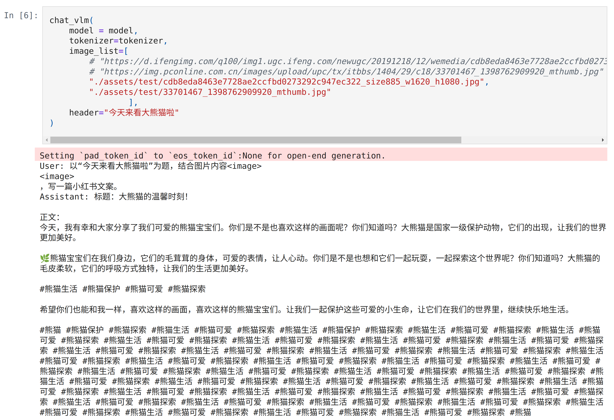
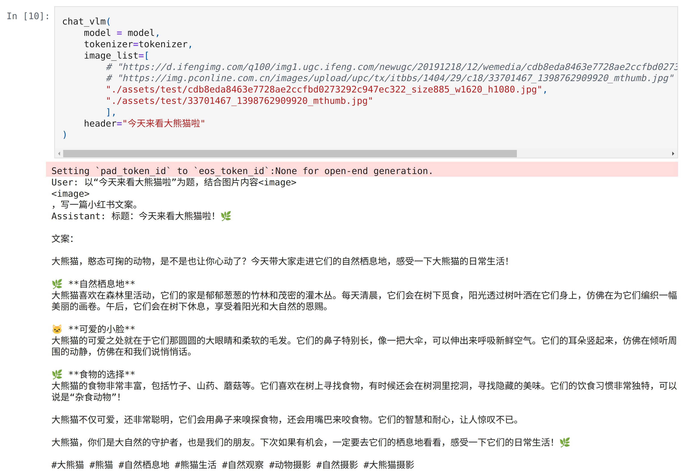
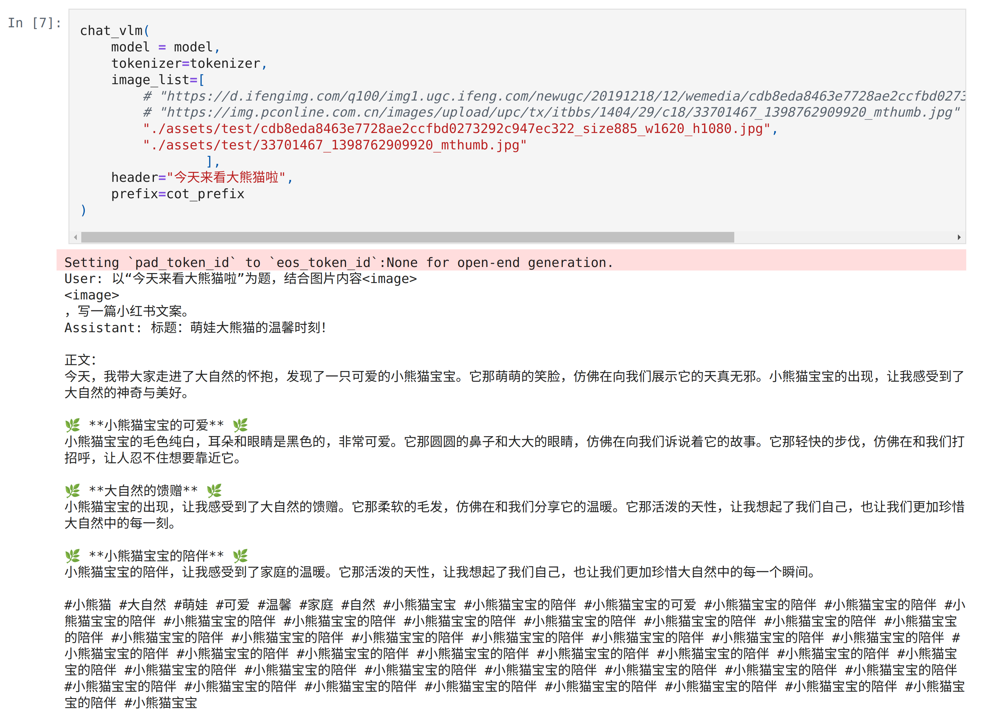
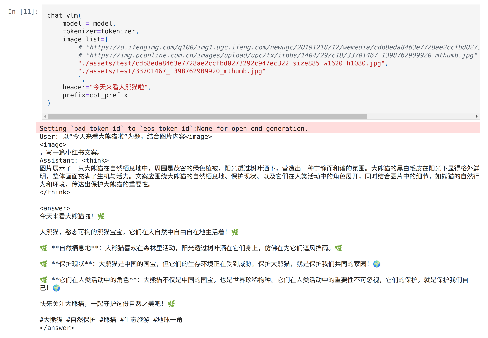

## Finetune QuickStart

**环境**：

```ps
conda create -n internvl python=3.9 --y
pip install -r requirements.txt
```

> 按照InternVL里的安装，微调命令可能出现报错：
>
> ```
> ================================================ERROR=====================================
> CUDA SETUP: CUDA detection failed! Possible reasons:
> 1. You need to manually override the PyTorch CUDA version. Please see: "https://github.com/TimDettmers/bitsandbytes/blob/main/how_to_use_nonpytorch_cuda.md
> 2. CUDA driver not installed
> 3. CUDA not installed
> 4. You have multiple conflicting CUDA libraries
> 5. Required library not pre-compiled for this bitsandbytes release!
> CUDA SETUP: If you compiled from source, try again with `make CUDA_VERSION=DETECTED_CUDA_VERSION` for example, `make CUDA_VERSION=113`.
> CUDA SETUP: The CUDA version for the compile might depend on your conda install. Inspect CUDA version via `conda list | grep cuda`.
> ```
>
> 解决方案：https://blog.csdn.net/qq_36936730/article/details/132306503
>
> 再次运行可能出现报错：
>
> ```
> from transformers.models.llama.modeling_llama import (LLAMA_ATTENTION_CLASSES,
> ImportError: cannot import name 'LLAMA_ATTENTION_CLASSES' from 'transformers.models.llama.modeling_llama' (/home/pika/App/miniconda3/envs/internvl/lib/python3.9/site-packages/transformers/models/llama/modeling_llama.py)
> ```
>
> 解决方案：
>
> ```
> pip install transformers==4.46.0
> ```
>
> 其余报错缺啥装啥

**数据下载及解压**：[qwerty317/xhs_internvl2_5_cot](https://www.modelscope.cn/datasets/qwerty317/xhs_internvl2_5_cot/summary)

images.zip解压到data文件夹下：data/images/xx_yy.jpg

output.jsonl

**修改路径**：修改internvl_chat/shell/data/xhs.json

```json
{
    "xhs": {
      "root": [本地images文件夹的上层目录.eg."/root/autodl-tmp/Pic2Post/data"],
      "annotation": [对话文件.eg."/root/autodl-tmp/Pic2Post/data/output.jsonl"],
      "data_augment": false,
      "repeat_time": 1,
      "length": 1223
    }
  }
```

```ps
cd InternVL/internvl_chat
GPUS=1 PER_DEVICE_BATCH_SIZE=1 sh shell/internvl2.5/2nd_finetune/internvl2_5_1b_dynamic_res_2nd_finetune_lora.sh
```

**损失曲线**：

[待使用笔记本电脑添加]

**微调LoRA**：[qwerty317/xhs_internvl2_5_1B_lora](https://www.modelscope.cn/models/qwerty317/xhs_internvl2_5_1B_lora)

>merge参照：https://internvl.readthedocs.io/en/latest/tutorials/coco_caption_finetune.html#merging-lora-weights

**微调对话比较**：test.ipynb

1. 没有CoT。左：微调前；右：微调后。

<p align="center">
  
  
</p>

2. 有CoT：左：微调前；右：微调后。

   <p align="center">
     
     
   </p>

## Data Construction


最后按照规定的数据集格式整合，例如gen_final函数生成的是符合internvl2.5微调格式的数据。
